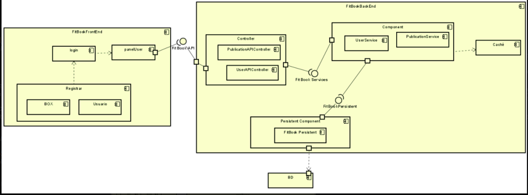
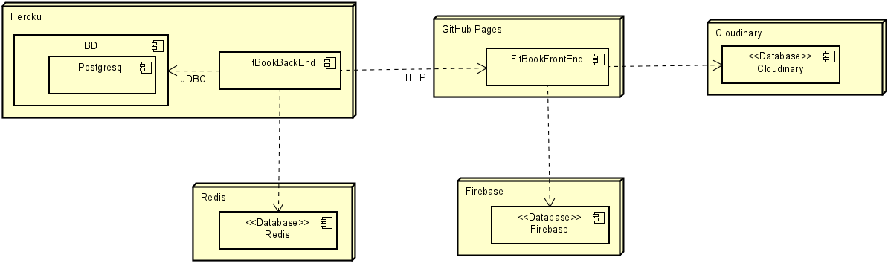

# FitBook :bicyclist: :mountain_bicyclist:
## ARSW

Repositorio del proyecto FitBook, que busca gestionar las clases de los gimnasios de Crossfit teniendo encuenta la pandemia que estamos viviendo

## Mockups

[Mockups](https://app.moqups.com/lH5QmmXTxY/view)

## Diagrama de Clases


## Diagrama Componentes y Conectores



## Diagrama de despliegue


## Casos de Uso


## Indicaciones de uso

Credenciales atleta: 
> Usuario: testa@testa.com
> Contraseña: 123456

Credenciales box: 
> Usuario: testb@testb.com
> Contraseña: 123456

### Creación de usuarios: 
Introducir: Nombre, C.C, correo electrónico, contraseña y confirmación de contraseña.

A continuación elegiremos el tipo de cuenta Atleta o Box, y por ultimo daremos click a crear cuenta.

### Dentro de la aplicación:
Publicaciones: 
   >Se pueden añadir nuevas publicaciones, ver publicaciones de otros usuarios y reaccionar a estas a través de likes.

Perfil:
   > Nos dejará elegir un box, seleccionar una foto de perfil y salir del box. Mostrará el nombre, el tipo de usuario y su correo.

Reservar:
   > Apartado para poder reservar las clases en su respectivo box, en el cual se podrá elegir el horario y se verán los cupos disponibles.

Logout:
   > Al darle click cerrará la sesión del usuario.

## Correr proyecto

Primero Clonaremos el repositorio, para eso desde nuestro navegador nos dirigiremos al siguiente link

```sh
https://github.com/FitBook-ARSW/FitBook.git
```

Para clonar el repositorio debemos de correr el siguiente comando en cmd o en la terminal 

```sh
git clone https://github.com/FitBook-ARSW/FitBook.git
 ```

 Y luego entraremos a la carperta Consumer_Server

```sh
$ cd Fitbook
 ```
Descargaremos y compilaremos el proyecto con el siguiente comando
Este comando nos descargara la dependencias necesarias, como lo son JUnit y Spark

 ```sh
$ mvn package
 ```
 Y finalmente para ejecutar la aplicación.

 ```sh
$ mvn spring-boot:run
 ```

### Prerequisitos

* Tener conocimientos básicos en la terminal o CMD
* Java SE Development Kit 8 -Java SE Runtime Environment 8 -Apache Maven.


## Despliegue en Heroku

[](https://secure-lake-15708.herokuapp.com/)

## Integración Continua

[](https://app.circleci.com/pipelines/github/FitBookApp/Back_FitBook)

## Correr Pruebas

Para correr las pruebas, ejecutamos el siguiente comando

```sh
$ mvn test
 ```

## Construido con

* [Maven](https://maven.apache.org/) - Dependency Management
* [JUnit](https://mvnrepository.com/artifact/junit/junit) - Test framework
* [VIM](https://www.vim.org/download.php) - Editor de Texto VIM

## Authors

 - Santiago Martínez Martínez 
    - Estudiante de la Escuela Colombiana De Ingeniería Julio Garavito 
    - Noveno Semestre

 - Javier Esteban Lopez
    - Estudiante de la Escuela Colombiana De Ingeniería Julio Garavito 
    - Noveno Semestre

 - Nikolas Bernal Giraldo
    - Estudiante de la Escuela Colombiana De Ingeniería Julio Garavito 
    - Noveno Semestre

## License

Este proyecto está licenciado bajo la GNU v3.0 - ver el archivo LICENSE.md para más detalles
 
